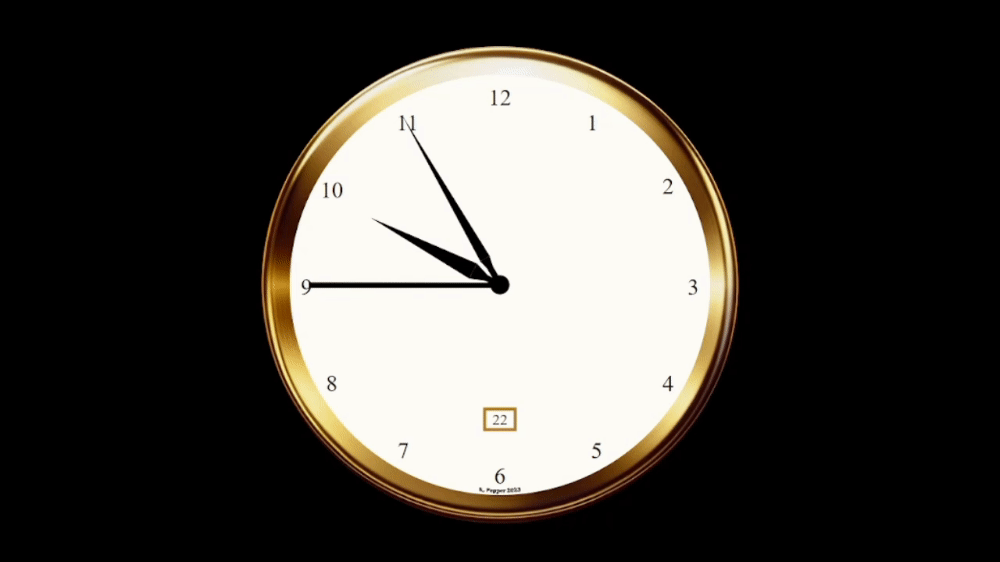

# Clock

Check out the [demo video](https://youtu.be/QdmSNsHW1Wg).

### Launch the page

1) Download the folder.
2) Run the file Clock.html in your browser.

### About

- The page was created in 2023.
- A working clock which is set according to the local time.
- When clicked, the inside is revealed.
